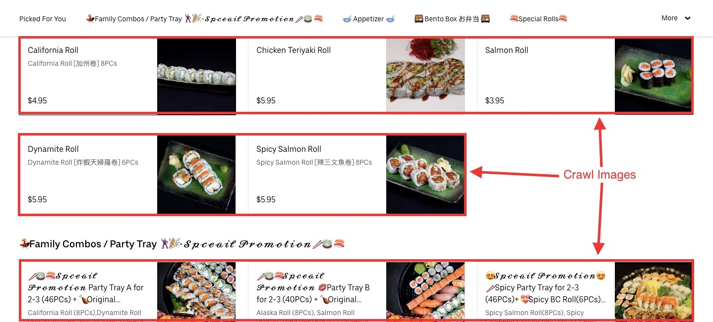
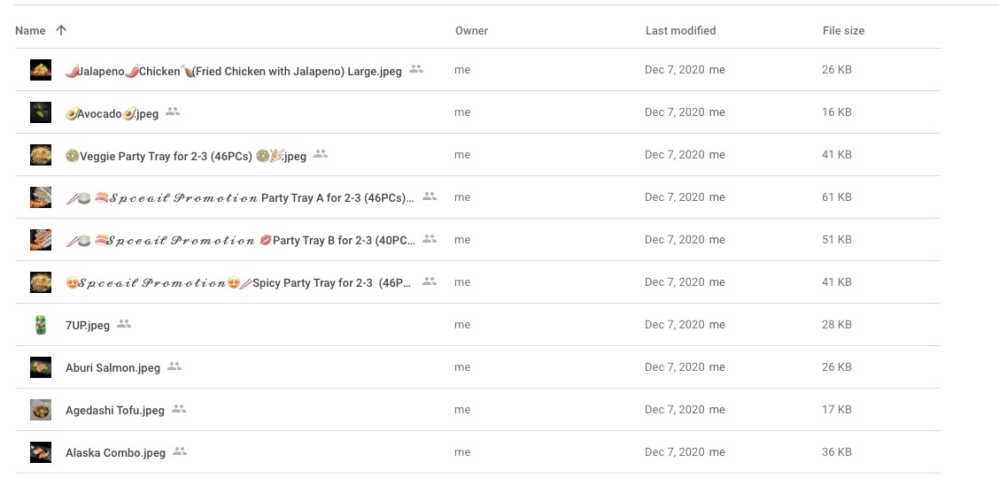

<!-- PROJECT LOGO -->
<br />
<p align="center">
  <h3 align="center">Image Crawler</h3>

  <p align="center">
    A simple PHP image crawler
  </p>
</p>

<!-- TABLE OF CONTENTS -->
<details open="open">
  <summary>Table of Contents</summary>
  <ol>
    <li>
      <a href="#about-the-project">About The Project</a>
      <ul>
        <li><a href="#built-with">Built With</a></li>
      </ul>
    </li>
    <li>
      <a href="#getting-started">Getting Started</a>
      <ul>
        <li><a href="#prerequisites">Prerequisites</a></li>
        <li><a href="#installation">Installation</a></li>
      </ul>
    </li>
  </ol>
</details>

<!-- ABOUT THE PROJECT -->
## About The Project



This project aims to crawl a webpage (specifically [UberEats](https://www.ubereats.com/ca/vancouver/food-delivery/hon-sushi/XAAB10yNTL6wz9qbi2gXfA) as an example) and retrieve images and all other relevant data from that page. Furthermore, these retrieved images will then be uploaded to Google Drive through the [Google Drive API](https://developers.google.com/drive/api/v3/quickstart/php).

Of course, this crawler can also easily be extended to crawl other webpages to grab other data formats as well.

### Built With

* [PHP 7.2](http://php.net)
* [Composer](https://getcomposer.org)
* [Google Drive API](https://developers.google.com/drive/api/v3/quickstart/php)


<!-- GETTING STARTED -->
## Getting Started

Please follow these simple steps to set up and run this project locally on your machine.

### Prerequisites

You must have PHP 5.4 or above [installed](https://www.php.net/downloads) on your local machine, along with the [Composer](https://getcomposer.org/doc/00-intro.md) dependency management tool. You must also install and enable the PHP CLI, as well as the cURL and JSON extensions if your PHP installation did not include these features ([here](https://www.php.net/manual/en/install.php) for more instructions).

### Setup

1. Clone the repo and navigate into the repo directory through the command line
   ```sh
   git clone https://github.com/alista24ftp/imagecrawler.git
   ```
2. Visit the Google Drive API [documentation page](https://developers.google.com/drive/api/v3/quickstart/php)

3. Turn on the Drive API by clicking the <b>Enable the Drive API</b> button.
Select the <i>Desktop App</i> option. In resulting dialog click <b>DOWNLOAD CLIENT CONFIGURATION</b> and save the file <i>credentials.json</i> to your cloned imagecrawler root directory (the one containing <i>app.php</i>).
4. Install the Google Client library via Composer
   ```sh
   composer require google/apiclient:^2.0
   ```
   See the library's [installation page](https://developers.google.com/api-client-library/php/start/installation) for the alternative installation options
   
5. Run the project
   ```sh
   php app.php
   ```
   The first time you run the sample, it will prompt you to authorize access:

    * Browse to the provided URL in your web browser.

    * If you are not already logged into your Google account, you will be prompted to log in. If you are logged into multiple Google accounts, you will be asked to select one account to use for the authorization.

    * Click the <b>Accept</b> button.
Copy the code you're given, paste it into the command-line prompt, and press <b>Enter</b>.

6. Check your target Google Drive folder. The folder should now contain the images that were crawled from the webpage.
   


